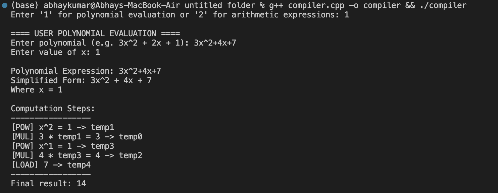
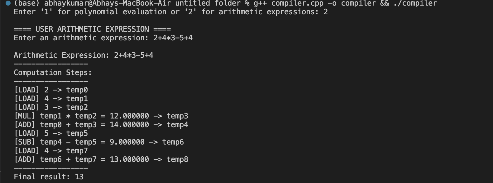

# Simple Expression and Polynomial Compiler

This is a simple compiler implemented in C++ that performs parsing, intermediate instruction generation, and evaluation of:
- **Arithmetic expressions** (like `2 + 3 * (4 - 1)`)
- **Polynomials** (like `3x^2 + 2x + 1`, evaluated at a given value of `x`)

## 📋 Features

### Arithmetic Expression Parser
- Supports `+`, `-`, `*`, and `/` operators
- Handles parentheses for precedence
- Generates intermediate **assembly-like instructions** (e.g., `ADD`, `MUL`, etc.)
- Detects syntax errors like invalid characters and division by zero

### Polynomial Parser and Evaluator
- Parses polynomial expressions with `x` and powers (e.g., `2x^3 - 4x + 7`)
- Evaluates the polynomial for a given value of `x`
- Displays step-by-step computation (e.g., power, multiplication, summing up terms)

## 🛠 How It Works

When you run the program, you are prompted to:
- Press `1` to evaluate a polynomial
- Press `2` to parse an arithmetic expression

Depending on the choice:
- **Arithmetic expressions** are parsed and instructions are printed.
- **Polynomials** are evaluated numerically, with detailed steps printed.

## SCREENSHOTS:
- Polynomial Output:



- Arithmetic Expression Output:




## ✅ Example Usage:

```bash
### Polynomial Mode (`1`) 

    Enter '1' for polynomial evaluation or '2' for arithmetic expressions: 1
    Enter a polynomial expression: 3x^2 + 2x + 1
    Enter the value of x: 2

    Computation Steps:
    -----------------
    [POW] x^2 = 4 -> temp0
    [MUL] 3 * temp0 = 12 -> temp1
    [POW] x^1 = 2 -> temp2
    [MUL] 2 * temp2 = 4 -> temp3
    [LOAD] 1 -> temp4
    [ADD] temp1 + temp3 = 16 -> temp5
    [ADD] temp5 + temp4 = 17 -> temp6
    -----------------
    Final result: 17


### Arithmetic Mode (`2`)

Enter '1' for polynomial evaluation or '2' for arithmetic expressions: 2
Enter an arithmetic expression: 2 + 3 * (4 - 1)

Generated Instructions:
-----------------
[SUB] 4 - 1 = 3 -> temp0
[MUL] 3 * temp0 = 9 -> temp1
[ADD] 2 + temp1 = 11 -> temp2
-----------------
Final result: 11
```


